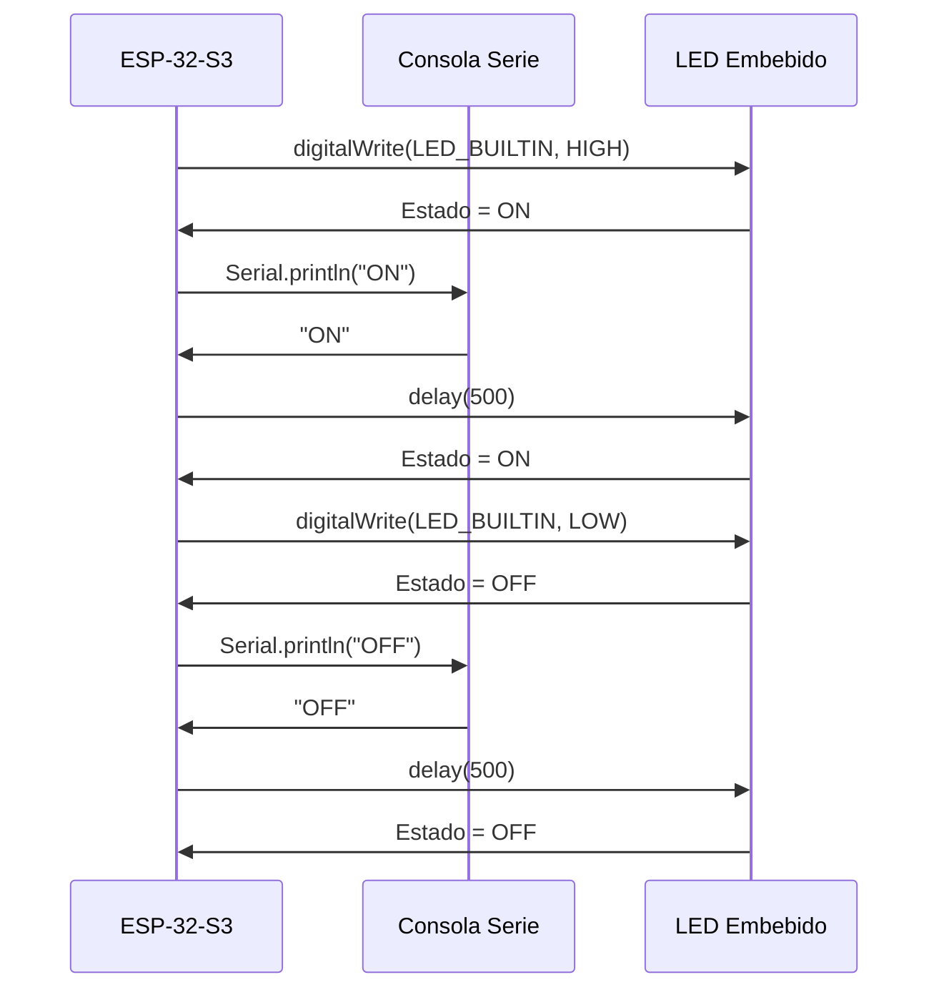
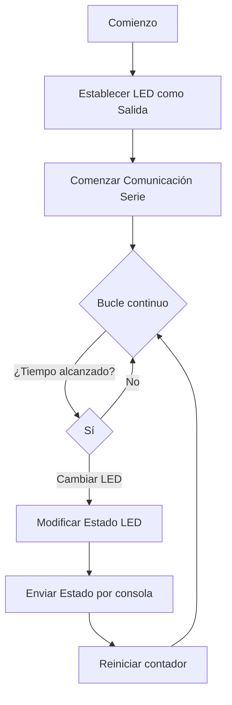
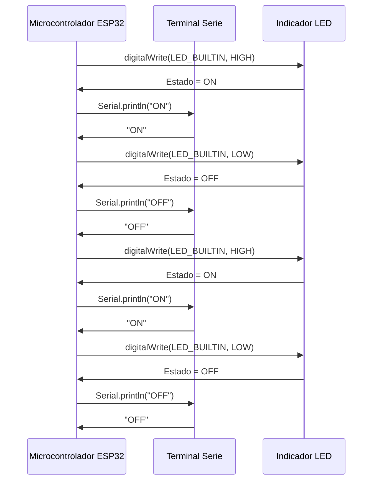

# Práctica 1: Blink con ESP32

## Propósito
Esta práctica busca generar un parpadeo continuo en un LED utilizando el ESP32. También se hará uso de la salida por consola para facilitar la depuración del código.

## Componentes requeridos
- Placa ESP32
- LED (interno o adicional)
- Resistencia (si aplica)
- Entorno de desarrollo (Arduino IDE o PlatformIO)

## Código de referencia
```cpp
#define LED_BUILTIN 2
#define DELAY 500

void setup() {
  pinMode(LED_BUILTIN, OUTPUT);
}

void loop() {
  digitalWrite(LED_BUILTIN, HIGH);
  delay(DELAY);
  digitalWrite(LED_BUILTIN, LOW);
  delay(DELAY);
}
```

## Variante utilizando delay
```cpp
#define LED_BUILTIN 2
#define DELAY 1000

void setup() {
  pinMode(LED_BUILTIN, OUTPUT);
  Serial.begin(115200);
}

void loop() {
  digitalWrite(LED_BUILTIN, HIGH);
  Serial.println("ON");
  delay(DELAY);
  digitalWrite(LED_BUILTIN, LOW);
  Serial.println("OFF");
  delay(DELAY);
}
```

## Variante sin uso de delay
```cpp
#define LED_BUILTIN 23
#define DELAY 500

void setup()
{
    Serial.begin(115200); 
    // Inicializa la comunicación por puerto serie
    pinMode(LED_BUILTIN, OUTPUT);
    // Define el pin del LED como salida
}
void loop()
{
    digitalWrite(LED_BUILTIN, HIGH); // Enciende el LED 
    Serial.println("ON"); // Imprime en consola
    digitalWrite(LED_BUILTIN, LOW); // Apaga el LED
    Serial.println("OFF");  
}
```

## Modificación para actuar directamente sobre registros GPIO
```cpp
#include <Arduino.h>

#define LED_BUILTIN 23
#define DELAY 1000

#define GPIO_OUT_REG 0x3FF4400C

void setup() {
  Serial.begin(115200);
  pinMode(LED_BUILTIN, OUTPUT);
}

void loop() {
  volatile uint32_t *gpio_out = (volatile uint32_t *)GPIO_OUT_REG;

  *gpio_out |= (1 << LED_BUILTIN);
  digitalWrite(LED_BUILTIN, HIGH);

  Serial.println("ON");

  delay(DELAY);

  *gpio_out ^= (1 << LED_BUILTIN);
  digitalWrite(LED_BUILTIN, LOW);

  Serial.println("OFF");

  delay(DELAY);
}
```

## Evaluaciones con frecuencia máxima

### Primer experimento
```cpp
#include <Arduino.h>

#define LED_BUILTIN 23

void setup() {                
  pinMode(LED_BUILTIN, OUTPUT);   
  Serial.begin(115200);
}

void loop() {
  Serial.println("ON");
  digitalWrite(LED_BUILTIN, HIGH);
  Serial.println("OFF");      
  digitalWrite(LED_BUILTIN, LOW);
}
```

### Segundo experimento
```cpp
#include <Arduino.h>

#define LED_BUILTIN 23
uint32_t *gpio_out = (uint32_t *)GPIO_OUT_REG;

void setup() {                
    pinMode(LED_BUILTIN, OUTPUT);   
    Serial.begin(115200);
}

void loop() {
    Serial.println("ON");
    *gpio_out |= (1 << LED_BUILTIN);
    Serial.println("OFF");      
    *gpio_out ^= (1 << LED_BUILTIN);
}
```

### Tercer experimento
```cpp
#include <Arduino.h>
#define LED_BUILTIN 23

void setup() {                
  pinMode(LED_BUILTIN, OUTPUT);   
}

void loop() {
  digitalWrite(LED_BUILTIN, HIGH);
  digitalWrite(LED_BUILTIN, LOW);
}
```

### Cuarto experimento
```cpp
#include <Arduino.h>

#define LED_BUILTIN 23
uint32_t *gpio_out = (uint32_t *)GPIO_OUT_REG;

void setup() {                
  pinMode(LED_BUILTIN, OUTPUT);   
}

void loop() {
  *gpio_out |= (1 << LED_BUILTIN);
  *gpio_out ^= (1 << LED_BUILTIN);
}
```

## Diagrama de flujo con retardo
mermaid
graph TD;
  A[Inicio] --> B[Configurar Pin LED como Salida]
  B --> C[Iniciar Terminal Serie]
  C --> D{Bucle Infinito}
  D -->|Encender LED| E[LED ON]
  E --> F[Enviar ON por Serial]
  F --> G[Esperar 1000 ms]
  G --> H[Apagar LED]
  H --> I[Enviar OFF por Serial]
  I --> J[Esperar 1000 ms]
  J --> D

## Diagrama temporal con delay


## Diagrama de flujo sin usar delay


## Diagrama de tiempo sin delays


## Tiempo inactivo del microcontrolador

Se puede estimar el tiempo en que el microcontrolador permanece sin realizar actividades mediante esta expresión:

**Tiempo en reposo = Tiempo de ciclo - Tiempo activo del programa**

Para ello, se mide cuánto dura el ciclo completo, incluyendo pausas como las provocadas por `delay()`, y se resta el tiempo real de ejecución activa. El resultado indica el intervalo de inactividad del procesador.
